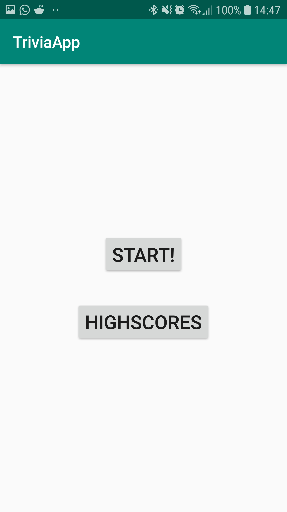
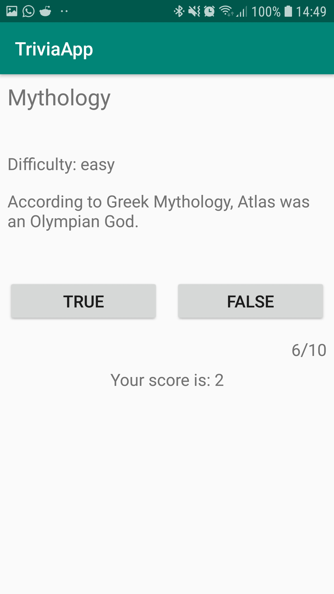
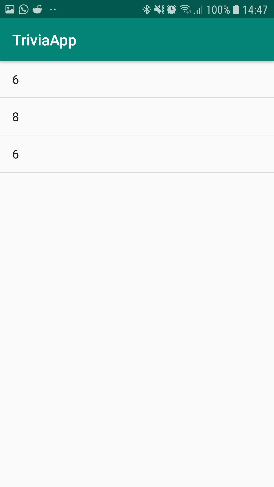

# TriviaApp

This app let's you play a Trivia Quiz!

In the main menu you can go to both the quiz and the highscores you've already gotten.

If you choose to start the quiz, you will get 10 questions of which you have to say whether they're true or false. You can see which what
category the question belongs to, the difficulty, the question itself, what question you're on, and what your current score is. When you're done
with the quiz it automatically submits your score to the highscores page.

If you choose to go to the highscores then you will see a list of the past scores that you have gotten on the quiz.

 

